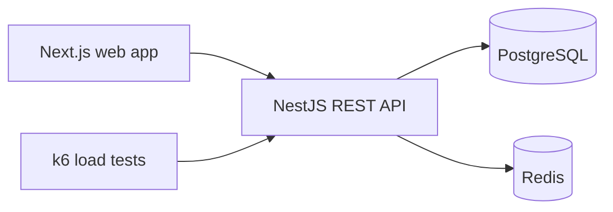

# WorkBoard

A full-stack work-management platform designed to demonstrate production-oriented application engineering.

## Stack

- **Web:** Next.js, React, TypeScript
- **API:** NestJS, TypeScript, REST, Swagger/OpenAPI
- **Data:** PostgreSQL
- **Caching/queues:** Redis
- **Operations:** Docker Compose, GitHub Actions
- **Testing/performance:** Jest, k6

## Planned capabilities

- Authenticated users and role-based access
- Workspaces, projects, tasks, and status workflows
- Redis-backed caching and background-job boundaries
- PostgreSQL persistence and migrations
- API documentation and health checks
- Unit/integration testing
- Repeatable Docker-based development
- k6 load-test scenarios for core API paths

## Architecture



## Repository structure

```text
apps/
  api/       NestJS API
  web/       Next.js frontend
infra/
  docker/    Container definitions
k6/          Load-test scenarios
```

## Local development

1. Copy environment variables:

   ```bash
   cp .env.example .env
   ```

2. Start infrastructure:

   ```bash
   docker compose up --build
   ```

3. Open:

   - Web: http://localhost:3000
   - API: http://localhost:3001
   - Swagger: http://localhost:3001/docs
   - Health: http://localhost:3001/api/health

## Validation

```bash
npm ci
npm run build
npm test
docker compose config
```

Run the load test against a running API:

```bash
k6 run k6/health.js
```

## Environment

See `.env.example`. Secrets are never committed; deployment environments should provide production values through their secret manager.

## Status

This repository is being developed incrementally as a public engineering project. The initial commit establishes the deployable monorepo, service boundaries, infrastructure configuration, CI, API documentation, and performance-test entry point.
